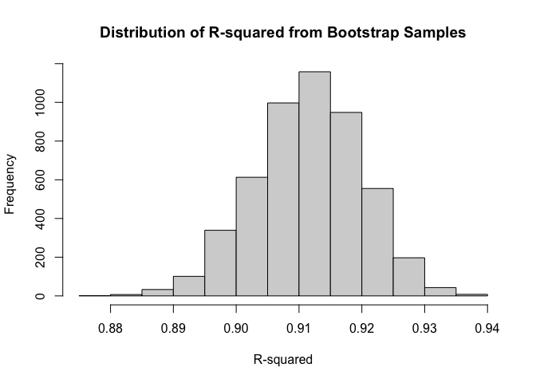
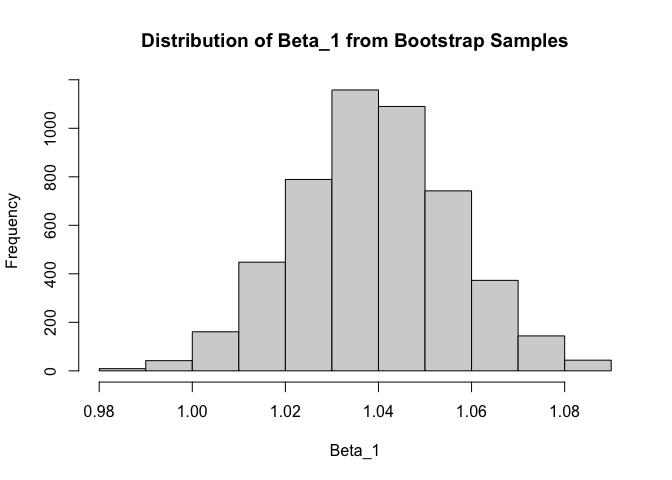
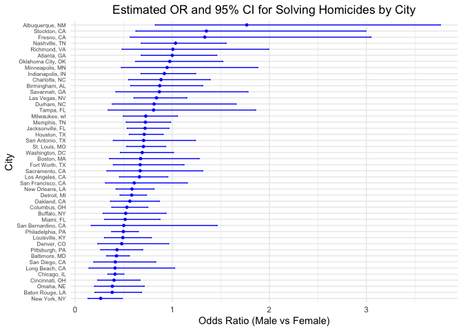
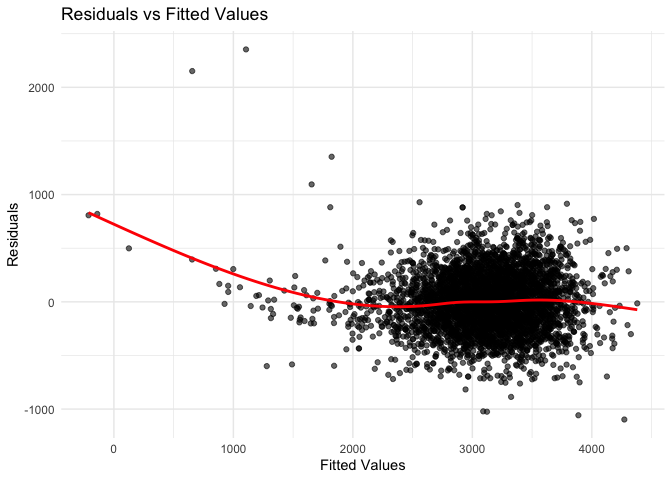

p8105_hw6_sz3319
================
Shiyu Zhang
2024-12-02

``` r
library(tidyverse)
library(knitr)
library(rvest)
library(purrr)
library(ggplot2)
library(rnoaa)
library(dplyr)
library(broom)
library(modelr)
```

## Problem 1

``` r
weather_df = rnoaa::meteo_pull_monitors(
  c("USW00094728"),
  var = c("PRCP", "TMIN", "TMAX"), 
  date_min = "2017-01-01",
  date_max = "2017-12-31"
) |>
  mutate(
    name = recode(id, USW00094728 = "CentralPark_NY"),
    tmin = tmin / 10,
    tmax = tmax / 10
  ) |>
  select(name, id, everything())

lm_fit = lm(tmax ~ tmin, data = weather_df)

glance_fit = broom::glance(lm_fit)
tidy_fit = broom::tidy(lm_fit)

# Bootstrap
set.seed(123)
bootstrap_samples = 5000
bootstrap_results = replicate(
  bootstrap_samples,
  {
    sample_indices = sample(nrow(weather_df), replace = TRUE)
    sample_data = weather_df[sample_indices, ]
    fit = lm(tmax ~ tmin, data = sample_data)
    c(broom::glance(fit)$r.squared, broom::tidy(fit)$estimate[2])
  }
)


r_squared_values = bootstrap_results[1, ]
beta_1_values = bootstrap_results[2, ]

hist(r_squared_values, main = "Distribution of R-squared from Bootstrap Samples", xlab = "R-squared")
```

<!-- -->

``` r
hist(beta_1_values, main = "Distribution of Beta_1 from Bootstrap Samples", xlab = "Beta_1")
```

<!-- -->

``` r
# 95% CI
quantile(r_squared_values, c(0.025, 0.975))
```

    ##      2.5%     97.5% 
    ## 0.8945701 0.9271042

``` r
quantile(beta_1_values, c(0.025, 0.975))
```

    ##     2.5%    97.5% 
    ## 1.005638 1.073103

## Problem 2

### 2.1 Clean data & filter

``` r
homicide_data = read_csv("data/homicide-data.csv", na = c("NA", "", ".")) |> 
  janitor::clean_names() |> 
  rename_with(~ gsub("^x", "", .))
```

``` r
homicides_cleaned = homicide_data |>
  filter(!(city %in% c("Dallas", "Phoenix", "Kansas City", "Tulsa"))) |> 
  filter(victim_race %in% c("White", "Black")) |> 
  filter(!is.na(victim_age)) |> 
  mutate(city_state = paste(city, state, sep = ", "),
         solved = if_else(disposition %in% c("Closed without arrest", "Open/No arrest"), 0, 1),
         victim_age = as.numeric(victim_age))
```

### 2.2 `glm` for Baltimore

``` r
# Choose Baldimore data.
baltimore_data = homicides_cleaned |> filter(city_state == "Baltimore, MD")

# glm for Baltimore
glm_fit_bal = glm(solved ~ victim_age + victim_sex + victim_race, data = baltimore_data, family = binomial)
tidy_glm_bal = broom::tidy(glm_fit_bal, conf.int = TRUE)
```

``` r
result_summary_bal = tidy_glm_bal |>
   mutate(
    OR = round(exp(estimate), 4), 
    conf.low = exp(estimate - 1.96 * std.error),
    conf.high = exp(estimate + 1.96 * std.error), 
    CI = paste0("(", round(conf.low, 4), ", ", round(conf.high, 4), ")")  
  ) |>
  select(term, OR, CI) |> 
  filter(term == "victim_sexMale")

result_summary_bal |>
  knitr::kable() 
```

| term           |     OR | CI               |
|:---------------|-------:|:-----------------|
| victim_sexMale | 0.4255 | (0.3246, 0.5579) |

- The adjusted odds ratio (OR) for male victims compared to female
  victims is **0.4255**, with a 95% confidence interval of **(0.3246,
  0.5579)**.
- It shows that when controlling other variables (age and race), the
  likelihood of a homicide involving a male victim being solved is
  42.55% of that for a female victim.
- Since the confidence interval is entirely below 1, this result is
  statistically significant, suggesting that homicides involving male
  victims are **less likely to be solved** compared to those involving
  female victims.

### 2.3 Analyze all cities

``` r
glm_results = homicides_cleaned |>
  group_by(city_state) |>
  nest() |>
  mutate(
    glm_model = map(data, ~ glm(solved ~ victim_age + victim_sex + victim_race, data = ., family = binomial)),
    tidy_model = map(glm_model, broom::tidy),
    conf_int = map(glm_model, ~ confint(.)) 
  ) |>
  mutate(
    tidy_model = map2(tidy_model, conf_int, ~ {
      conf_df = as.data.frame(.y)
      names(conf_df) = c("conf.low", "conf.high")
      tidy_df = bind_cols(.x, conf_df)
      tidy_df
    })
  ) |>
  unnest(cols = tidy_model)
```

``` r
# adjusted OR & CI
glm_results = glm_results |>
  mutate(
    OR = exp(estimate),  
    conf.low = exp(conf.low), 
    conf.high = exp(conf.high), 
    CI = paste0("(", round(conf.low, 4), ", ", round(conf.high, 4), ")") 
  ) |>
  filter(term == "victim_sexMale") 

glm_results_summary =
  glm_results |>
  select(city_state, OR, CI, p.value) |> 
  arrange(OR) |> 
  knitr::kable(, digits = 4) 

glm_results_summary
```

| city_state         |     OR | CI               | p.value |
|:-------------------|-------:|:-----------------|--------:|
| New York, NY       | 0.2624 | (0.1328, 0.485)  |  0.0000 |
| Baton Rouge, LA    | 0.3814 | (0.2043, 0.6836) |  0.0017 |
| Omaha, NE          | 0.3825 | (0.1988, 0.7109) |  0.0030 |
| Cincinnati, OH     | 0.3998 | (0.2314, 0.667)  |  0.0006 |
| Chicago, IL        | 0.4101 | (0.3361, 0.5009) |  0.0000 |
| Long Beach, CA     | 0.4102 | (0.1427, 1.0242) |  0.0718 |
| San Diego, CA      | 0.4130 | (0.1914, 0.8302) |  0.0172 |
| Baltimore, MD      | 0.4255 | (0.3242, 0.5576) |  0.0000 |
| Pittsburgh, PA     | 0.4308 | (0.2626, 0.6956) |  0.0007 |
| Denver, CO         | 0.4791 | (0.2327, 0.9625) |  0.0411 |
| Louisville, KY     | 0.4906 | (0.3015, 0.7836) |  0.0034 |
| Philadelphia, PA   | 0.4963 | (0.376, 0.6499)  |  0.0000 |
| San Bernardino, CA | 0.5003 | (0.1655, 1.4624) |  0.2057 |
| Miami, FL          | 0.5152 | (0.304, 0.8734)  |  0.0135 |
| Buffalo, NY        | 0.5206 | (0.2884, 0.9358) |  0.0290 |
| Columbus, OH       | 0.5325 | (0.377, 0.7479)  |  0.0003 |
| Oakland, CA        | 0.5631 | (0.3637, 0.8671) |  0.0094 |
| Detroit, MI        | 0.5823 | (0.4619, 0.7335) |  0.0000 |
| New Orleans, LA    | 0.5849 | (0.4219, 0.8122) |  0.0013 |
| San Francisco, CA  | 0.6075 | (0.3117, 1.1551) |  0.1336 |
| Los Angeles, CA    | 0.6619 | (0.4565, 0.9541) |  0.0279 |
| Sacramento, CA     | 0.6688 | (0.3263, 1.3144) |  0.2548 |
| Fort Worth, TX     | 0.6690 | (0.3935, 1.1212) |  0.1312 |
| Boston, MA         | 0.6740 | (0.3534, 1.2768) |  0.2257 |
| Washington, DC     | 0.6902 | (0.4654, 1.0123) |  0.0608 |
| St. Louis, MO      | 0.7032 | (0.5299, 0.9319) |  0.0144 |
| San Antonio, TX    | 0.7046 | (0.3928, 1.2383) |  0.2303 |
| Houston, TX        | 0.7110 | (0.557, 0.9057)  |  0.0059 |
| Jacksonville, FL   | 0.7198 | (0.5359, 0.9651) |  0.0283 |
| Memphis, TN        | 0.7232 | (0.5261, 0.9836) |  0.0420 |
| Milwaukee, wI      | 0.7271 | (0.4951, 1.0542) |  0.0977 |
| Tampa, FL          | 0.8077 | (0.3395, 1.8599) |  0.6194 |
| Durham, NC         | 0.8124 | (0.3824, 1.658)  |  0.5761 |
| Las Vegas, NV      | 0.8373 | (0.6059, 1.1511) |  0.2776 |
| Savannah, GA       | 0.8670 | (0.4186, 1.7802) |  0.6974 |
| Birmingham, AL     | 0.8700 | (0.5714, 1.3138) |  0.5111 |
| Charlotte, NC      | 0.8839 | (0.5507, 1.3906) |  0.6004 |
| Indianapolis, IN   | 0.9187 | (0.6785, 1.2413) |  0.5819 |
| Minneapolis, MN    | 0.9470 | (0.4759, 1.881)  |  0.8757 |
| Oklahoma City, OK  | 0.9741 | (0.6229, 1.52)   |  0.9079 |
| Atlanta, GA        | 1.0001 | (0.6803, 1.4583) |  0.9997 |
| Richmond, VA       | 1.0061 | (0.4835, 1.9936) |  0.9866 |
| Nashville, TN      | 1.0342 | (0.6807, 1.556)  |  0.8729 |
| Fresno, CA         | 1.3352 | (0.5673, 3.0475) |  0.4964 |
| Stockton, CA       | 1.3517 | (0.6256, 2.9941) |  0.4475 |
| Albuquerque, NM    | 1.7675 | (0.8247, 3.7619) |  0.1393 |

``` r
# make plot
glm_results |>
  ggplot(aes(x = reorder(city_state, OR), y = OR)) +
  geom_point(size = 1, color = "blue") +  
  geom_errorbar(aes(ymin = conf.low, ymax = conf.high), width = 0.2, color = "blue") + 
  coord_flip() + 
  labs(
    title = "Estimated OR and 95% CI for Solving Homicides by City",
    x = "City",
    y = "Odds Ratio (Male vs Female)"
  ) +
  theme_minimal() + 
  theme(
    axis.text.y = element_text(size = 6),  
    plot.title = element_text(hjust = 0.5) 
  )
```

<!-- -->

The result shows that:

- Most cities have OR less than 1, such as Omaha, NE and New York, NY.
  This indicates that male victim homicides are less likely to be solved
  compared to female victims in these cities.
- In some cities, the 95% confidence intervals are **fully below 1**
  (eg. New York, Baton Rouge), suggesting that this difference is
  statistically significant, which means that male victim homicides are
  significantly less likely to be solved in these cities compared to
  female victim cases. However, in cities such as Long Beach, CA and San
  Bernardino, CA, the confidence interval **crosses 1**, which means
  that in these cities, the influence of gender on solving homicides is
  **not** statistically significant.
- Some cities have OR greater than 1, such as Albuquerque, NM, Stockton,
  CA, and Fresno, CA. However, all CIs cross 1, which means that in
  these cities, the influence of gender on solving homicides is not
  statistically significant.
- Some cities, such as Albuquerque, NM, have wide confidence intervals,
  indicating high variability in the data, which may because of smaller
  sample sizes or less stable data, leading to lower accuracy in
  estimates.

## Problem 3

``` r
# Load data
birthweight_data = read_csv("data/birthweight.csv", na = c("NA", "", ".")) |> 
  janitor::clean_names() |> 
  rename_with(~ gsub("^x", "", .))
```

``` r
# data clean
birthweight_clean = birthweight_data |>
  mutate(
    babysex = factor(babysex),
    frace = factor(frace),
    mrace = factor(mrace),
    malform = factor(malform)
  ) |> 
  drop_na()
```

``` r
# model with all variables
full_model = lm(bwt ~ .,
                 data = birthweight_clean)

# Stepwise to select variables (Using AIC to select)
stepwise_model = step(full_model, direction = "both", trace = FALSE)

summary(stepwise_model)
```

    ## 
    ## Call:
    ## lm(formula = bwt ~ babysex + bhead + blength + delwt + fincome + 
    ##     gaweeks + mheight + mrace + parity + ppwt + smoken, data = birthweight_clean)
    ## 
    ## Residuals:
    ##      Min       1Q   Median       3Q      Max 
    ## -1097.18  -185.52    -3.39   174.14  2353.44 
    ## 
    ## Coefficients:
    ##               Estimate Std. Error t value Pr(>|t|)    
    ## (Intercept) -6098.8219   137.5463 -44.340  < 2e-16 ***
    ## babysex2       28.5580     8.4549   3.378 0.000737 ***
    ## bhead         130.7770     3.4466  37.944  < 2e-16 ***
    ## blength        74.9471     2.0190  37.120  < 2e-16 ***
    ## delwt           4.1067     0.3921  10.475  < 2e-16 ***
    ## fincome         0.3180     0.1747   1.820 0.068844 .  
    ## gaweeks        11.5925     1.4621   7.929 2.79e-15 ***
    ## mheight         6.5940     1.7849   3.694 0.000223 ***
    ## mrace2       -138.7925     9.9071 -14.009  < 2e-16 ***
    ## mrace3        -74.8868    42.3146  -1.770 0.076837 .  
    ## mrace4       -100.6781    19.3247  -5.210 1.98e-07 ***
    ## parity         96.3047    40.3362   2.388 0.017004 *  
    ## ppwt           -2.6756     0.4274  -6.261 4.20e-10 ***
    ## smoken         -4.8434     0.5856  -8.271  < 2e-16 ***
    ## ---
    ## Signif. codes:  0 '***' 0.001 '**' 0.01 '*' 0.05 '.' 0.1 ' ' 1
    ## 
    ## Residual standard error: 272.3 on 4328 degrees of freedom
    ## Multiple R-squared:  0.7181, Adjusted R-squared:  0.7173 
    ## F-statistic: 848.1 on 13 and 4328 DF,  p-value: < 2.2e-16

``` r
# Model with chosen variables
p3_model = lm(bwt ~ babysex + bhead + blength + delwt + fincome + gaweeks + mheight + mrace + parity + ppwt + smoken, data = birthweight_clean)
```

``` r
# add prediction & residual
birthweight_clean = birthweight_clean |>
  add_predictions(p3_model) |>
  add_residuals(p3_model)

# Make plot: fitted values vs. residuals
ggplot(birthweight_clean, aes(x = pred, y = resid)) +
  geom_point(alpha = 0.6) +
  geom_smooth(se = FALSE, color = "red") +
  labs(title = "Residuals vs Fitted Values",
       x = "Fitted Values",
       y = "Residuals") +
  theme_minimal()
```

<!-- -->

The plot shows that residuals are not evenly distributed around zero,
especially with a noticeable trend when fitted values are small. This
suggests that the model might be missing some nonlinear relationships.
Adding nonlinear terms or transforming variables could improve the
model’s accuracy.

### 3.2 Compare Three Models

``` r
# Two Models
model1 = lm(bwt ~ blength + gaweeks, data = birthweight_clean)

model2 = lm(bwt ~ bhead + blength + babysex + bhead * blength + blength * babysex + bhead * babysex + bhead * blength * babysex, data = birthweight_clean)
```

``` r
# Monte Carlo
set.seed(123)
cv_splits = crossv_mc(birthweight_clean, 100)

cv_results = cv_splits |>
  mutate(
    p3_model = map(train, ~ p3_model),
    model1 = map(train, ~ model1),
    model2 = map(train, ~ model2),
    rp3_model = map2_dbl(p3_model, test, ~ rmse(.x, .y)),
    rmse_model1 = map2_dbl(model1, test, ~ rmse(.x, .y)),
    rmse_model2 = map2_dbl(model2, test, ~ rmse(.x, .y))
  )

# mean_rmse
mean_rmse = cv_results |>
  summarise(
    p3_model = mean(rp3_model),
    model1 = mean(rmse_model1),
    model2 = mean(rmse_model2)
  )

kable(mean_rmse)
```

| p3_model |  model1 |  model2 |
|---------:|--------:|--------:|
| 271.8169 | 330.014 | 286.489 |

From the result,

- the `p3_model` has the smallest RMSE, which means that it performs the
  best in predicting birth weight;
- `model1` has an RMSE of 330.014, which is the highest among all
  models. Therefore, only birth length and gestational age are
  insufficient to adequately explain the variation in birth weight;
- `model2` has an RMSE of 286.489. It has head circumference, length,
  sex, and their interaction terms, but the predictive performance is
  not as good as the `p3_model`.
